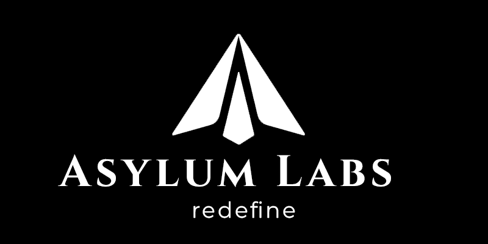

### Unlocking the future of DeFi with next-gen liquidity unlocking tools.

Asylum Labs is on a mission to build an ecosystem of DeFi tools that support investors in their transition to onchain finance with a suite of primitives that help unlock liquidity and manage risk for any token on every blockchain.

## Ecosystem

Asylum Labs is comprised of a number of platforms:

- **Hedging and Equity Swaps:** Swap gains or losses over a fixed period or open call/put options OTC.
- **Liquidity Tools:** LP locks, Uniswap v4 hooks, and concentrated liquidity strategies.
- **Escrow management:** Secure assets in a trustless manner until specific conditions have been met.
- **Index tokens:** Tokenized index baskets that utilize the liquidity of all underlying tokens.
- **Tokenized Vaults:** Distribute ownership of assets to multiple parties.
- **Public DeFi Oracle:** onchain spot prices, and data on open options and liquidity.

---

### 🛠 &nbsp;Networks

<table style="border: none; margin: 0 auto;">
<tr>
<td width="25%" style="text-align: center;"></td>
<td width="25%" style="text-align: center;"></td>
<td width="25%" style="text-align: center;"></td>
<td width="25%" style="text-align: center;"></td>
</tr>
<tr>
<td width="100%" style="text-align: center;" colspan="4"></td>
</tr>
<tr>
<td width="100%" style="text-align: center;" colspan="4"></td>
</tr>
</table>

### Safe Multi-Sig

The Asylum Labs Multi-Sig is available on all EVM networks that the protocol is deployed on.

 

---

### ✍️ Blog Posts

Asylum Labs publishes articles on Paragraph, a decentralized publishing platform built on Farcaster. You can stay up to date with the latest articles byubscribing to the newsletter.

---

### 🫙 Support Us

Asylum Labs is currently pre-token launch, and currently funded by donations. When we do launch our ecosystem token, a percentage of supply will be reserved for donors.

 

